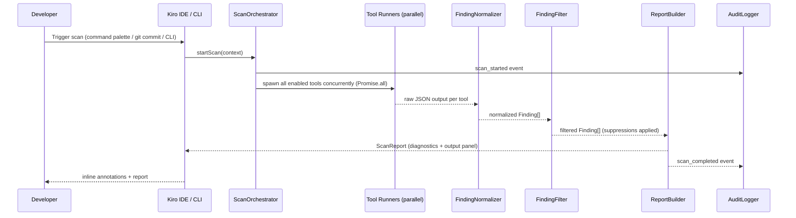
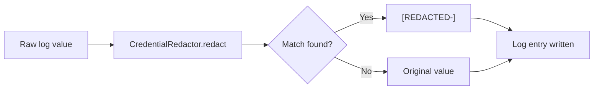

# Design Document: Agent Security Scanner

## Overview

The Agent Security Scanner is a Windows-only security tool delivered as a Kiro IDE extension (VS Code-compatible) with a companion CLI. It orchestrates six open-source scanning tools — Semgrep, Gitleaks, Trivy, npm audit, pip-audit, and detect-secrets — as child processes, aggregates their JSON output into a unified finding model, and surfaces results through VS Code diagnostic APIs, a terminal report, and a tamper-evident audit log.

The scanner targets developers building AI agents and MCPs on Windows workstations. It covers OWASP Top 10, CWE Top 25, OWASP LLM Top 10, OWASP Agentic Top 10 (ASI01–ASI10), STRIDE threat patterns, supply chain integrity, credential/secret detection, MCP security, and AI transparency patterns. Scans can be triggered manually (IDE command palette or CLI) or automatically via a Git pre-commit hook.

### Design Goals

- **Parallel execution**: all scanning tools run concurrently to meet the 30-second pre-commit and 5-minute full-scan performance budgets.
- **Unified finding model**: every tool's output is normalized into a single `Finding` type before any downstream processing.
- **Credential safety**: no secret value ever reaches a log file; a shared `CredentialRedactor` component is applied to all log writes.
- **Tamper-evident audit trail**: SHA-256 hash chaining on the audit log makes deletions and edits detectable.
- **Policy layering**: admin policy overrides developer-local config; developer config overrides built-in defaults.
- **Offline-first**: scans work without network access; network is only needed for rule/tool updates and optional log forwarding.

---

## Architecture

### High-Level Component Diagram

```mermaid
graph TD
    subgraph Kiro IDE Extension
        CMD[Command Palette Commands]
        DIAG[DiagnosticCollection Publisher]
        SB[StatusBarItem]
        OC[OutputChannel]
        CA[CodeActionProvider]
    end

    subgraph Scanner Core
        ORCH[ScanOrchestrator]
        NORM[FindingNormalizer]
        FILT[FindingFilter\n(suppressions + policy)]
        RPT[ReportBuilder]
        PROG[ProgressReporter]
    end

    subgraph Tool Runners (parallel)
        SR[SemgrepRunner]
        GLR[GitleaksRunner]
        TR[TrivyRunner]
        NAR[NpmAuditRunner]
        PAR[PipAuditRunner]
        DSR[DetectSecretsRunner]
    end

    subgraph Storage
        AL[AuditLogger\n(JSON Lines + hash chain)]
        DL[DebugLogger\n(JSON Lines, opt-in)]
        SH[ScanHistoryStore]
        RM[RuleManifest]
        CFG[ConfigLoader\n(admin policy + local)]
    end

    subgraph Shared Utilities
        CR[CredentialRedactor]
        CV[ChecksumVerifier]
        PX[ProxyConfig]
    end

    CMD --> ORCH
    ORCH --> SR & GLR & TR & NAR & PAR & DSR
    SR & GLR & TR & NAR & PAR & DSR --> NORM
    NORM --> FILT
    FILT --> RPT
    RPT --> DIAG & OC & SH & AL
    ORCH --> PROG --> SB & OC
    AL --> CR
    DL --> CR
    CFG --> ORCH & FILT
```

### Execution Flow



---

## Components and Interfaces

### ScanOrchestrator

The central coordinator. Reads config, resolves which tool runners to activate, launches them in parallel via `Promise.all`, collects results, and drives the progress reporter.

```typescript
interface ScanContext {
  workspaceRoot: string;
  scanType: 'manual' | 'pre-commit' | 'history';
  stagedFiles?: string[];       // pre-commit only
  enabledCategories: ScanCategory[];
  debug: boolean;
}

interface ScanCategory {
  id: 'sast' | 'secrets' | 'dependencies' | 'mcp' | 'supply-chain' | 'history';
  tools: ToolRunner[];
}

interface ScanOrchestrator {
  runScan(ctx: ScanContext): Promise<ScanReport>;
  cancelScan(): void;
}
```

### ToolRunner (base interface)

Each of the six tool runners implements this interface. Runners are responsible for building the subprocess command, spawning it, capturing stdout/stderr, and returning raw parsed JSON.

```typescript
interface ToolRunner {
  readonly toolId: string;
  readonly minVersion: string;
  isAvailable(): Promise<boolean>;
  getVersion(): Promise<string>;
  run(ctx: ScanContext): Promise<RawToolOutput>;
}

interface RawToolOutput {
  toolId: string;
  exitCode: number;
  rawJson: unknown;
  stderr: string;
  elapsedMs: number;
}
```

**Concrete runners:**

| Class | Tool | Key flags |
|---|---|---|
| `SemgrepRunner` | semgrep | `--json --config <rules> <target>` |
| `GitleaksRunner` | gitleaks | `detect --report-format json [--no-git for history]` |
| `TrivyRunner` | trivy | `fs --format json <target>` |
| `NpmAuditRunner` | npm audit | `--json` |
| `PipAuditRunner` | pip-audit | `--format json` |
| `DetectSecretsRunner` | detect-secrets | `scan --all-files --json` |

### FindingNormalizer

Converts each tool's proprietary JSON schema into the canonical `Finding` type. One normalizer class per tool.

```typescript
interface FindingNormalizer {
  normalize(raw: RawToolOutput): Finding[];
}
```

### FindingFilter

Applies suppressions and admin policy to the normalized finding list. Produces two lists: active findings and suppressed findings.

```typescript
interface FindingFilter {
  apply(findings: Finding[], suppressions: Suppression[], policy: AdminPolicy): FilterResult;
}

interface FilterResult {
  active: Finding[];
  suppressed: SuppressedFinding[];
  invalidatedSuppressions: Suppression[];  // suppressed by policy change
}
```

### ReportBuilder

Assembles the `ScanReport` from filtered findings, attaches rule manifest metadata, computes trend delta from prior scan history, and writes `last-scan-report.json`.

```typescript
interface ReportBuilder {
  build(filtered: FilterResult, manifest: RuleManifest, history: ScanReport | null): ScanReport;
  persist(report: ScanReport, workspaceRoot: string): Promise<void>;
}
```

### AuditLogger

Append-only writer for the JSON Lines audit log. Applies `CredentialRedactor` to every entry before writing. Maintains the SHA-256 hash chain.

```typescript
interface AuditLogger {
  log(event: AuditEvent): Promise<void>;
  verify(): Promise<VerifyResult>;
  rotate(): Promise<void>;
}
```

### DebugLogger

Optional structured logger (JSON Lines). Only instantiated when `debugLogging: true` or `--debug` flag is present. Applies `CredentialRedactor` to all values before writing.

```typescript
interface DebugLogger {
  log(entry: DebugEntry): void;
  isEnabled(): boolean;
}
```

### CredentialRedactor

Shared singleton. Applies the same regex/entropy patterns used during scanning to redact credential values from any string before it is written to any log. Updated atomically when `update-rules` runs.

```typescript
interface CredentialRedactor {
  redact(value: string): RedactResult;
  redactObject(obj: Record<string, unknown>): Record<string, unknown>;
}

interface RedactResult {
  redacted: string;
  redactionsApplied: number;
  credentialTypesFound: string[];
}
```

### ConfigLoader

Merges configuration from three layers (lowest to highest priority): built-in defaults → admin policy file → developer-local config file.

```typescript
interface ConfigLoader {
  load(workspaceRoot: string): ResolvedConfig;
}

interface ResolvedConfig {
  adminPolicy: AdminPolicy | null;
  merged: ScannerConfig;
  overrides: ConfigOverride[];  // which keys were overridden by admin policy
}
```

### IDE Integration Components

These wrap VS Code extension APIs and are only active when running inside the Kiro IDE (not CLI mode).

```typescript
interface DiagnosticPublisher {
  publish(findings: Finding[]): void;
  clear(): void;
  removeFinding(findingId: string): void;  // for suppression without re-scan
}

interface StatusBarReporter {
  setPhase(phase: string, elapsed: number): void;
  setComplete(summary: string): void;
  setError(message: string): void;
}

interface ScanCodeActionProvider extends vscode.CodeActionProvider {
  provideCodeActions(document, range, context): vscode.CodeAction[];
  // Returns "Suppress finding" quick-fix actions
}
```

### Pre-commit Hook

A PowerShell script installed at `.git/hooks/pre-commit`. It delegates to the Scanner CLI and exits with code 0 or 1 based on the scan result. The `--no-verify` bypass is detected by the scanner's absence of a `scan_started` event and logged as `commit_scan_bypassed` on the next scan.

```powershell
# .git/hooks/pre-commit (template)
$result = & scanner scan --pre-commit --staged-files (git diff --cached --name-only)
exit $LASTEXITCODE
```

### SetupManager

Handles `scanner setup`: checks tool availability, downloads missing tools, verifies checksums, installs pre-commit hook, and supports `--silent` mode.

```typescript
interface SetupManager {
  run(options: SetupOptions): Promise<SetupResult>;
  checkTool(toolId: string): Promise<ToolCheckResult>;
  downloadTool(toolId: string, targetDir: string): Promise<void>;
  installPreCommitHook(repoRoot: string): Promise<void>;
}
```

### SelfUpdateManager

Handles `scanner self-update`: fetches release manifest, compares versions, downloads and checksum-verifies the new binary, and performs atomic replacement.

```typescript
interface SelfUpdateManager {
  checkForUpdate(): Promise<UpdateCheckResult>;
  applyUpdate(release: ReleaseInfo): Promise<void>;
}
```

---

## Data Models

### Finding

The canonical representation of a single security issue, produced by `FindingNormalizer` and consumed by all downstream components.

```typescript
interface Finding {
  id: string;                    // deterministic hash of (toolId + ruleId + filePath + lineNumber)
  toolId: string;                // e.g., "semgrep", "gitleaks"
  ruleId: string;                // tool-specific rule identifier
  severity: Severity;
  title: string;
  filePath: string;              // workspace-relative
  lineNumber: number;
  columnNumber?: number;
  standardIdentifier: string;   // e.g., "OWASP LLM01", "CWE-798", "CVE-2024-1234", "ASI02"
  description: string;
  remediationGuidance: string;  // concrete, language-specific
  referenceUrl: string;
  category: FindingCategory;
  language?: string;             // source language of the affected file
  credentialType?: string;       // for credential findings
  commitHash?: string;           // for git history findings
  isKnownSafeContext?: boolean;  // for env-var credential findings
}

type Severity = 'Critical' | 'High' | 'Medium' | 'Low' | 'Informational';

type FindingCategory =
  | 'owasp-top10'
  | 'cwe-top25'
  | 'owasp-llm-top10'
  | 'owasp-agentic-top10'
  | 'stride'
  | 'credentials'
  | 'dependencies'
  | 'mcp-config'
  | 'mcp-malicious-code'
  | 'supply-chain'
  | 'git-history'
  | 'agent-attack-patterns'
  | 'ai-transparency'
  | 'kiro-agent-files'
  | 'windows-credential-manager';
```

### ScanReport

```typescript
interface ScanReport {
  id: string;                    // UUID
  timestamp: string;             // ISO 8601
  scanType: 'manual' | 'pre-commit' | 'history';
  workspaceRoot: string;
  scannerVersion: string;
  ruleManifest: RuleManifest;
  elapsedMs: number;
  summary: FindingSummary;
  findings: Finding[];
  suppressedFindings: SuppressedFinding[];
  trend?: TrendDelta;            // present when prior history exists
  staleRulesets: string[];       // rulesets not updated in 30+ days
}

interface FindingSummary {
  critical: number;
  high: number;
  medium: number;
  low: number;
  informational: number;
  total: number;
}

interface TrendDelta {
  criticalDelta: number;
  highDelta: number;
  mediumDelta: number;
  lowDelta: number;
  informationalDelta: number;
  comparedToReportId: string;
}
```

### Suppression

```typescript
interface Suppression {
  ruleId: string;
  filePath: string;              // workspace-relative
  justification: string;         // required; must be non-empty
  addedAt: string;               // ISO 8601
  addedBy: string;               // Windows username
  requiresJustification: boolean; // true for env-var credential findings (Req 5 AC 9)
}

interface SuppressedFinding {
  finding: Finding;
  suppression: Suppression;
}
```

### AdminPolicy

```typescript
interface AdminPolicy {
  version: string;
  mcpAllowlistEntries: McpAllowlistEntry[];
  suppressionBaseline: Suppression[];
  minimumToolVersions: Record<string, string>;
  enabledCategories?: FindingCategory[];
  disabledCategories?: FindingCategory[];
  allowLocalSuppressions: boolean;
}
```

### ScannerConfig

```typescript
interface ScannerConfig {
  // Scan behavior
  enabledCategories: FindingCategory[];
  customRulesDir: string;                  // default: .kiro/security/custom-rules/
  additionalSemgrepRegistries: string[];

  // Performance
  parallelToolLimit: number;               // default: 6 (all tools)

  // History
  scanHistoryRetentionCount: number;       // default: 10

  // Rules
  ruleStalenessDays: number;               // default: 30

  // Logging
  debugLogging: boolean;                   // default: false
  auditLogPath: string;                    // default: .kiro/security/audit.log
  logForwarding?: LogForwardingConfig;

  // Network
  proxy?: ProxyConfig;

  // Updates
  selfUpdateCheckIntervalDays: number;     // default: 7
  adminPolicyPath: string;                 // default: .kiro/security/admin-policy.json
}

interface LogForwardingConfig {
  type: 'file' | 'webhook';
  destination: string;                     // file path or HTTPS URL
  retryOnFailure: boolean;
}

interface ProxyConfig {
  httpProxy?: string;
  httpsProxy?: string;
  noProxy?: string;
}
```

### RuleManifest

```typescript
interface RuleManifest {
  lastUpdated: string;           // ISO 8601
  rulesets: RulesetEntry[];
}

interface RulesetEntry {
  name: string;                  // e.g., "semgrep-owasp-top10"
  sourceUrl: string;
  version: string;               // semver or timestamp
  lastUpdated: string;           // ISO 8601
  standardsCovered: string[];    // e.g., ["OWASP Top 10", "CWE Top 25"]
}
```

### AuditEvent

```typescript
interface AuditEvent {
  timestamp: string;             // ISO 8601
  event_type: AuditEventType;
  scanner_version: string;
  prev_hash: string;             // SHA-256 of previous raw JSON line; "genesis" for first entry
  [key: string]: unknown;        // event-specific fields
}

type AuditEventType =
  | 'scan_started'
  | 'scan_completed'
  | 'scan_tool_error'
  | 'commit_blocked'
  | 'commit_scan_bypassed'
  | 'suppression_added'
  | 'suppression_removed'
  | 'suppression_invalidated_by_policy'
  | 'allowlist_entry_added'
  | 'allowlist_entry_removed'
  | 'config_changed'
  | 'admin_policy_loaded'
  | 'admin_policy_conflict'
  | 'rules_updated'
  | 'self_update_completed'
  | 'self_update_failed'
  | 'scan_history_deleted'
  | 'onboarding_completed';
```

### McpAllowlistEntry

```typescript
interface McpAllowlistEntry {
  urlOrIdentifier: string;
  description?: string;
  addedAt: string;               // ISO 8601
}
```

---

## File Structure

```
.kiro/
  security/
    audit.log                    # JSON Lines, append-only, hash-chained
    audit-<timestamp>.log        # rotated audit logs (max 3 retained)
    scanner-debug.log            # JSON Lines, opt-in, rotated at 50 MB
    last-scan-report.json        # most recent scan report
    rule-manifest.json           # ruleset versions and timestamps
    suppressions.json            # developer-local suppressions
    mcp-allowlist.json           # approved MCP server URLs/identifiers
    admin-policy.json            # admin-distributed policy (configurable path)
    scan-history/
      scan-<ISO-timestamp>.json  # retained scan reports (default: 10)
    custom-rules/
      *.yaml                     # Semgrep-compatible custom rule files

scanner/                         # extension + CLI source root
  src/
    extension.ts                 # VS Code extension entry point
    cli.ts                       # CLI entry point (commander.js)
    orchestrator/
      ScanOrchestrator.ts
      ScanContext.ts
      ProgressReporter.ts
    runners/
      ToolRunner.ts              # base interface
      SemgrepRunner.ts
      GitleaksRunner.ts
      TrivyRunner.ts
      NpmAuditRunner.ts
      PipAuditRunner.ts
      DetectSecretsRunner.ts
    normalizers/
      FindingNormalizer.ts       # base interface
      SemgrepNormalizer.ts
      GitleaksNormalizer.ts
      TrivyNormalizer.ts
      NpmAuditNormalizer.ts
      PipAuditNormalizer.ts
      DetectSecretsNormalizer.ts
    filter/
      FindingFilter.ts
      SuppressionManager.ts
    report/
      ReportBuilder.ts
      ScanHistoryStore.ts
    ide/
      DiagnosticPublisher.ts
      StatusBarReporter.ts
      ScanCodeActionProvider.ts
      OutputChannelReporter.ts
    logging/
      AuditLogger.ts
      DebugLogger.ts
      CredentialRedactor.ts
    config/
      ConfigLoader.ts
      AdminPolicyLoader.ts
      RuleManifestManager.ts
    setup/
      SetupManager.ts
      ChecksumVerifier.ts
      PreCommitHookInstaller.ts
    update/
      SelfUpdateManager.ts
      RuleUpdater.ts
    models/
      Finding.ts
      ScanReport.ts
      Suppression.ts
      AdminPolicy.ts
      ScannerConfig.ts
      AuditEvent.ts
      RuleManifest.ts
    utils/
      ProxyConfig.ts
      ProcessSpawner.ts          # wraps child_process.spawn with timeout + streaming
  templates/
    pre-commit.ps1               # pre-commit hook template
  docs/
    installation.md
    admin-deployment.md
    usage.md
    configuration-reference.md
    security-files.md
    faq.md
    troubleshooting.md
    CHANGELOG.md
```

---

## Tool Orchestration: Parallel Execution Design

All enabled tool runners are launched concurrently using `Promise.all`. Each runner spawns its tool as a child process via `ProcessSpawner`, which wraps Node.js `child_process.spawn` with:

- A configurable timeout (default: 120 s per tool for full scans, 25 s for pre-commit scans)
- Streaming stdout/stderr capture (buffered, not blocking)
- Debug log emission for command line, exit code, timing, and truncated output (≤ 50 KB)

```typescript
// Simplified orchestration loop
async function runAllTools(ctx: ScanContext, runners: ToolRunner[]): Promise<RawToolOutput[]> {
  const results = await Promise.allSettled(
    runners.map(r => r.run(ctx))
  );

  const outputs: RawToolOutput[] = [];
  for (const result of results) {
    if (result.status === 'fulfilled') {
      outputs.push(result.value);
    } else {
      // Tool error: log to audit log, continue scan
      await auditLogger.log({ event_type: 'scan_tool_error', ... });
    }
  }
  return outputs;
}
```

### Tool-to-Category Mapping

| Scan Category | Primary Tool(s) | Supplementary Tool(s) |
|---|---|---|
| OWASP Top 10 / CWE Top 25 | Semgrep | — |
| OWASP LLM Top 10 | Semgrep | — |
| OWASP Agentic Top 10 | Semgrep | — |
| STRIDE patterns | Semgrep | — |
| Agent attack patterns | Semgrep | — |
| AI transparency | Semgrep | — |
| Windows Credential Manager enforcement | Semgrep | — |
| Credentials / secrets (files) | Gitleaks | detect-secrets |
| Credentials / secrets (git history) | Gitleaks (history mode) | — |
| Dependencies (Node.js) | Trivy | npm audit |
| Dependencies (Python) | Trivy | pip-audit |
| Dependencies (other) | Trivy | — |
| MCP config security | Semgrep | — |
| MCP malicious code | Semgrep + Trivy | — |
| Supply chain integrity | Semgrep | Trivy |
| Kiro agent / steering files | Semgrep | — |

### Pre-commit Scope Restriction

For pre-commit scans, `SemgrepRunner` and `GitleaksRunner` receive only the list of staged files (from `git diff --cached --name-only`) rather than the full workspace. `TrivyRunner`, `NpmAuditRunner`, and `PipAuditRunner` always scan the full manifest files (not just staged lines) because a staged change to `package.json` may introduce a vulnerable transitive dependency not visible from the diff alone.

---

## Credential Redaction Pipeline

The `CredentialRedactor` is applied at two points:

1. **Before writing to AuditLogger** — every `AuditEvent` field value is passed through `redactObject()`.
2. **Before writing to DebugLogger** — every `DebugEntry` field value, including tool stdout/stderr, is passed through `redactObject()`.

The redactor uses the same regex patterns and entropy thresholds as the scanning rules. When `update-rules` runs, it atomically replaces the redactor's pattern set alongside the Gitleaks/detect-secrets rule updates, ensuring consistency (Req 31 AC 10).



---

## Audit Log Hash Chain

Each audit log entry includes a `prev_hash` field containing the SHA-256 hash of the previous entry's raw JSON line (before the newline). The first entry uses `"prev_hash": "genesis"`.

```
Line 1: {"timestamp":"...","event_type":"scan_started","prev_hash":"genesis",...}
         └─ SHA-256 → "abc123..."
Line 2: {"timestamp":"...","event_type":"scan_completed","prev_hash":"abc123...",...}
         └─ SHA-256 → "def456..."
Line 3: {"timestamp":"...","event_type":"suppression_added","prev_hash":"def456...",...}
```

The `audit-log --verify` command recomputes the chain from line 1 and reports the first line where `prev_hash` does not match the computed hash of the preceding line.

---

## Admin Policy Layering

Configuration is resolved in three layers at scan startup:

```
Built-in defaults
      ↓  (overridden by)
Admin policy file (.kiro/security/admin-policy.json)
      ↓  (overridden by, only where policy permits)
Developer-local config (.kiro/security/scanner-config.json)
```

When `allowLocalSuppressions: false` in the admin policy, `FindingFilter` ignores the developer's `suppressions.json` entirely and applies only `suppressionBaseline` from the policy. When a developer attempts to add a suppression in this mode, the `SuppressionManager` rejects it and notifies the developer.

---

## Error Handling

### Tool Failure Isolation

Each tool runner is wrapped in an independent `Promise.allSettled` slot. A failure in one tool (non-zero exit code, timeout, parse error) does not abort the scan. The orchestrator:

1. Logs a `scan_tool_error` audit event with the tool name, exit code, and error message.
2. Continues collecting results from other tools.
3. Includes a warning in the `ScanReport` noting which tools failed.
4. For pre-commit scans: allows the commit to proceed (Req 2 AC 6).

### Configuration Errors

- **Malformed admin policy**: logged as `admin_policy_conflict`, scanner falls back to defaults, developer is notified (Req 25 AC 7).
- **Missing suppressions.json**: treated as empty suppression list; no error.
- **Missing mcp-allowlist.json**: treated as empty allowlist; all external MCPs produce informational findings.

### Checksum Verification Failures

During `scanner setup` or `self-update`, if a downloaded binary's SHA-256 does not match the published checksum, `ChecksumVerifier` throws a `ChecksumMismatchError`. The setup/update is aborted, the partial download is deleted, and the error is reported to the developer. No partial installation is left on disk.

### Log Rotation

- **Audit log** rotates at 10 MB; retains last 3 rotated files.
- **Debug log** rotates at 50 MB; retains last 1 rotated file.
- Rotation is performed by renaming the current file with a timestamp suffix before opening a new file. This is atomic on Windows (rename is atomic within the same volume).

### Network Failures

- Rule updates and self-update: fail gracefully with an error message; existing rules/binary remain intact.
- Log forwarding: failed entries are queued in memory and retried on the next scan event; an informational finding is added to the next scan report if forwarding has been failing.
- Trivy vulnerability DB update: if the network is unavailable, Trivy uses its cached DB; the scan report notes the DB age.

---

## Testing Strategy

### Unit Tests

Unit tests cover the pure-logic components using example-based and property-based approaches:

- **FindingNormalizer** (per tool): given a known raw JSON fixture, assert the normalized `Finding[]` matches expected values.
- **FindingFilter**: given a finding list and suppression list, assert correct active/suppressed split.
- **CredentialRedactor**: given strings containing known secret patterns, assert redaction is applied; given clean strings, assert no redaction.
- **AuditLogger hash chain**: given a sequence of events, assert `prev_hash` values are correct; assert `--verify` detects a tampered entry.
- **ConfigLoader**: given admin policy + local config combinations, assert correct merged output and override tracking.
- **ReportBuilder**: given filtered findings and prior history, assert trend delta is computed correctly.
- **ScanHistoryStore**: given a retention limit, assert oldest reports are deleted when the limit is exceeded; assert protected reports (open suppressions, unresolved criticals) are not deleted.

### Property-Based Tests

See Correctness Properties section below. Property tests use [fast-check](https://github.com/dubzzz/fast-check) (TypeScript/JavaScript PBT library), configured to run a minimum of 100 iterations per property.

Each property test is tagged with a comment in the format:
```
// Feature: agent-security-scanner, Property N: <property text>
```

### Integration Tests

Integration tests verify the end-to-end subprocess invocation of each tool against a small fixture repository:

- **SemgrepRunner**: run against a fixture file containing a known SQL injection pattern; assert the finding is produced.
- **GitleaksRunner**: run against a fixture file containing a hardcoded API key; assert the finding is produced.
- **TrivyRunner**: run against a fixture `package.json` with a known-vulnerable dependency; assert the CVE finding is produced.
- **Pre-commit hook**: invoke the hook script against a staged fixture file; assert exit code 1 for critical findings.
- **Audit log forwarding**: configure a local file forwarder; assert entries are written to the forwarding destination.

### Smoke Tests

- `scanner setup --silent` completes without error on a clean Windows environment.
- All six tools are available and meet minimum version requirements after setup.
- `scanner scan` produces a scan report file at `.kiro/security/last-scan-report.json`.
- `audit-log --verify` reports no tampering on a freshly written log.

---

## Correctness Properties

*A property is a characteristic or behavior that should hold true across all valid executions of a system — essentially, a formal statement about what the system should do. Properties serve as the bridge between human-readable specifications and machine-verifiable correctness guarantees.*

Property-based tests use [fast-check](https://github.com/dubzzz/fast-check) and are configured to run a minimum of 100 iterations per property. Each test is tagged with a comment in the format:
```
// Feature: agent-security-scanner, Property N: <property text>
```

---

### Property 1: Pre-commit exit code reflects highest finding severity

*For any* scan result, the pre-commit hook exit code SHALL be 1 (block) if and only if the result contains at least one Critical or High severity finding; for any scan result containing only Medium, Low, or Informational findings (or no findings), the exit code SHALL be 0 (allow).

**Validates: Requirements 2.3, 2.4**

---

### Property 2: Scan report summary counts match finding list

*For any* list of findings produced by a scan, the summary counts in the `ScanReport` (critical, high, medium, low, informational, total) SHALL equal the actual counts of findings at each severity level in the findings array.

**Validates: Requirements 7.1**

---

### Property 3: Every finding contains all required fields

*For any* finding produced by any tool normalizer, the finding SHALL contain non-empty values for: `id`, `toolId`, `ruleId`, `severity`, `title`, `filePath`, `lineNumber`, `standardIdentifier`, `description`, `remediationGuidance`, and `referenceUrl`.

**Validates: Requirements 7.2**

---

### Property 4: Suppressed findings are excluded from the active finding list

*For any* combination of a finding list and a suppression list, every finding whose `(ruleId, filePath)` pair matches a suppression entry SHALL appear in the suppressed findings list and SHALL NOT appear in the active findings list.

**Validates: Requirements 8.2**

---

### Property 5: Credential values are never written to any log

*For any* audit event or debug log entry that contains a string value matching a known credential pattern (API key, token, password, private key), the value written to the log file SHALL be replaced with `[REDACTED-<credential-type>]` and the original credential value SHALL NOT appear anywhere in the written log line.

**Validates: Requirements 23.10, 31.5**

---

### Property 6: Audit log is append-only and grows monotonically

*For any* sequence of N audit events written to the audit log, the log file SHALL contain exactly N lines after writing; writing M additional events SHALL result in exactly N+M lines. No previously written line SHALL be modified or removed.

**Validates: Requirements 23.1, 23.3**

---

### Property 7: Audit log hash chain is valid after any sequence of writes

*For any* sequence of audit events written to the log, the `prev_hash` field of each entry SHALL equal the SHA-256 hash of the preceding entry's raw JSON line (with the first entry using `"genesis"`), such that `audit-log --verify` reports no tampering.

**Validates: Requirements 23.4**

---

### Property 8: Allowlisted MCP URLs do not produce unverified-MCP findings

*For any* MCP configuration file referencing a set of external MCP URLs, and any allowlist containing a subset of those URLs, the scanner SHALL NOT produce an "unverified external MCP" finding for any URL that is present in the allowlist.

**Validates: Requirements 11.2**

---

### Property 9: Admin policy settings take precedence over developer-local config

*For any* combination of an admin policy file and a developer-local config file where both specify a value for the same configuration key, the resolved configuration SHALL use the admin policy value for that key, and the developer-local value SHALL be ignored.

**Validates: Requirements 25.2**

---

### Property 10: IDE diagnostics mirror the active finding list

*For any* scan result, the set of diagnostics published to the VS Code `DiagnosticCollection` SHALL contain exactly one diagnostic per active finding, at the correct file path and line number, with no diagnostics for suppressed findings.

**Validates: Requirements 19.1**

---

### Property 11: Consecutive scans replace, not accumulate, IDE diagnostics

*For any* two consecutive scans producing different finding sets, after the second scan completes the `DiagnosticCollection` SHALL contain only the diagnostics from the second scan; no diagnostic from the first scan that is not also in the second scan SHALL remain.

**Validates: Requirements 19.5**

---

### Property 12: Scan history retention limit is enforced

*For any* scan history directory state containing more reports than the configured retention limit, after a new scan completes the history directory SHALL contain at most `retentionLimit` reports, and the deleted report SHALL be the oldest one that is not protected (i.e., not referenced by an open suppression and not containing unresolved Critical findings).

**Validates: Requirements 21.5**

---

### Property 13: Credential findings in .env and config files are Critical severity

*For any* `.env` file, `mcp.json`, `appsettings.json`, or other designated config file content containing a string that matches a known credential pattern, the scanner SHALL produce a finding with `severity === 'Critical'`.

**Validates: Requirements 5.2**

---

### Property 14: Known-safe credential contexts produce Informational, not High, severity

*For any* source code pattern that reads a credential from a Windows environment variable AND matches a Known-Safe Credential Context (Docker ENV, GitHub Actions secrets, Azure DevOps variable groups, AWS CodeBuild valueFrom, Docker Compose environment blocks, or well-known cloud SDK credential chain variable names), the scanner SHALL produce a finding with `severity === 'Informational'` rather than `severity === 'High'`.

**Validates: Requirements 5.5**

